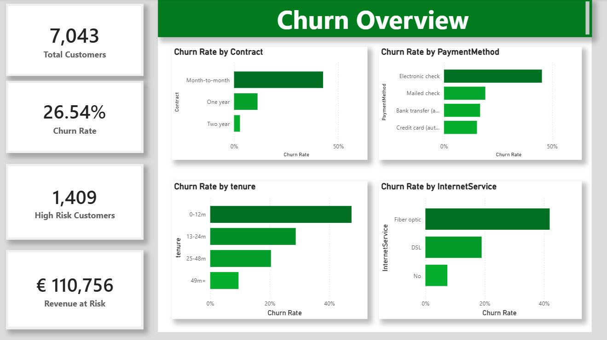
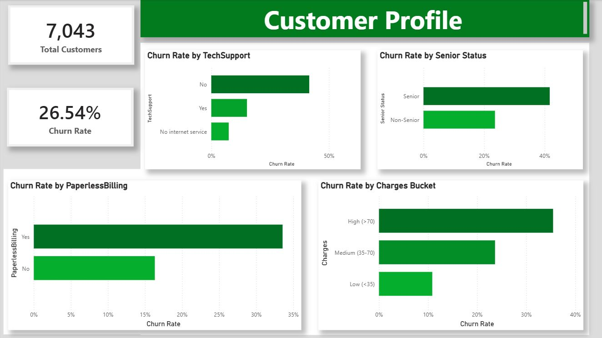
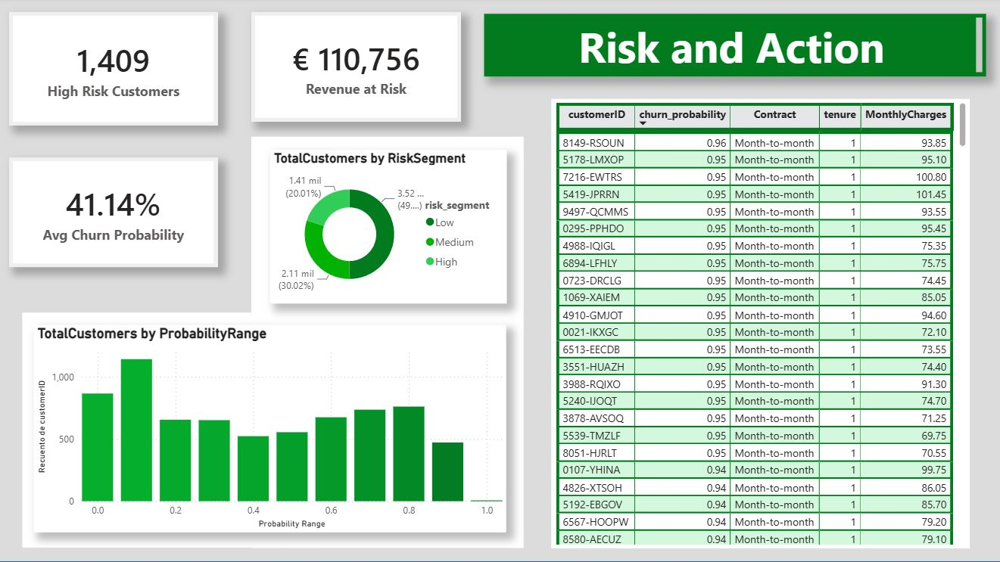

# Customer Churn: Prediction and Retention Dashboard


An end-to-end churn project on the Telco dataset (7,043 customers). It trains a model to predict which customers are about to leave, and then feeds those predictions into a three-page Power BI dashboard that a retention team could actually use.

The point was not just to get a good score. It was to answer a business question: who is most likely to leave, why, and how much monthly revenue is on the line.

---

## Dashboard

Three pages, each answering a different question.

**Page 1: Churn Overview.** The headline numbers and the strongest churn drivers.


**Page 2: Customer Profile.** Who churns, broken down by services, demographics, billing and price.


**Page 3: Risk and Action.** The model output: risk segments, the probability distribution, and a ranked list of the customers to call first.


---

## Results

| Metric | Value | What it means |
|---|---|---|
| Recall (churn class) | 0.81 | Of the customers who really churned, the model flags 81% of them. This is the metric that matters here: missing a churner costs more than a false alarm. |
| ROC-AUC (test set) | 0.844 | Held-out test performance of the final tuned model. |
| High-risk customers | 1,409 | The top 20% of the base by churn probability. A short, workable list, not a vague warning about the whole customer base. |
| Monthly revenue at risk | 110,756 EUR | Recurring monthly revenue tied to the high-risk segment. This is the number that gets a manager to act. |

The segmentation holds up when checked against reality: inside the high-risk group the actual churn rate is **67.5%**, against a **26.5%** baseline. So the label is doing its job.

---

## Model Comparison

Three models were trained under the same conditions and compared with 5-fold cross-validation. XGBoost won, but not by a huge margin over a well-tuned logistic regression, which is worth being honest about.

| Model | Recall (churn) | Notes |
|---|---|---|
| Logistic Regression | 0.78 | Scaler inside a pipeline, class weights for imbalance. Surprisingly close to the winner. |
| Random Forest | 0.48 | Clearly weaker here. Without class-weight handling it defaults to predicting the majority class and misses most churners. |
| XGBoost (tuned) | 0.81 | Final model. Tuned with GridSearchCV, `scale_pos_weight` for class imbalance. |


---

## What Drives Churn

The analysis pointed to a consistent set of drivers, later confirmed by the model.

| Driver | Finding |
|---|---|
| Tenure | The single strongest predictor by permutation importance. New customers (0 to 12 months) churn the most, and risk falls steadily the longer they stay. |
| Contract type | Month-to-month customers churn far more than those on one or two-year contracts, which rank as strong protective signals. |
| Internet service | Fiber-optic customers churn more, likely tied to higher price and expectations. |
| Payment method | Electronic check payers churn noticeably more than the rest. |
| Low-impact features | Gender, partner and streaming services carry almost no weight, so they were confirmed as irrelevant for prediction. |

---

## Design Decisions

A few choices are worth explaining, since they are what separate a working notebook from a defensible one.

**Out-of-fold probabilities for the dashboard.** The customer scores that feed Power BI are generated with `cross_val_predict`, so each customer gets a probability from a model that never trained on them. Scoring everyone with a model that had already seen them would inflate the numbers (a form of data leakage). The model itself was validated the standard way: a held-out test set (AUC 0.844) and 5-fold cross-validation, where all three models landed within a narrow band, confirming the ranking was not a fluke of one split.

**Risk segments by percentile, not fixed cutoffs.** Fixed probability thresholds put a third of the base into "high risk", which is not actionable. Instead, customers are ranked and split by percentile: top 20% is High, next 30% is Medium, bottom 50% is Low. That keeps High as a real priority list, and it also sidesteps the fact that `scale_pos_weight` shifts the raw probabilities upward.

**Recall over accuracy.** With a 26.5% churn rate, a model that predicts "nobody churns" already scores 73% accuracy and is useless. The whole project optimises for catching churners (recall), because in retention the expensive mistake is letting a leaver slip through unnoticed.

**Python trains, Power BI shows.** The model runs in Python; Power BI only reads the exported predictions and visualises them. Nothing is trained inside the dashboard. This mirrors how the split usually works in practice: modelling on one side, communication on the other.

---

## Repository Structure

```
telco-churn-prediction/
│
├── README.md
├── requirements.txt
│
├── notebooks/
│   ├── 02_eda.ipynb              # Exploratory analysis and business questions
│   ├── 03_data_cleaning.ipynb    # Cleaning and feature encoding
│   └── 04_modeling.ipynb         # Training, tuning, evaluation, export
│
├── data/
│   ├── raw/
│   │   └── Telco-Customer-Churn.csv
│   └── processed/
│       └── churn_predictions.csv # Model output that feeds the dashboard
│
└── dashboard/
    ├── churn_dashboard.pbix
    └── images/                   # The three screenshots above
```

---

## How to Reproduce

```bash
git clone https://github.com/<carlosgomezparicio>/churn-prediction.git
cd churn-prediction

python -m venv venv && source venv/bin/activate   # Windows: venv\Scripts\activate
pip install -r requirements.txt
```

Run the notebooks in order (`02` then `03` then `04`). The last one exports `churn_predictions.csv`, which the Power BI file reads. Open `dashboard/churn_dashboard.pbix` in Power BI Desktop to explore the dashboard.

---

## Tech Stack

| Layer | Tools |
|---|---|
| Data and modelling | pandas, scikit-learn, XGBoost |
| Explainability | SHAP, permutation importance |
| Experiment tracking | MLflow |
| Dashboard | Power BI (DAX measures, calculated columns) |
| Environment | Jupyter Notebook |
